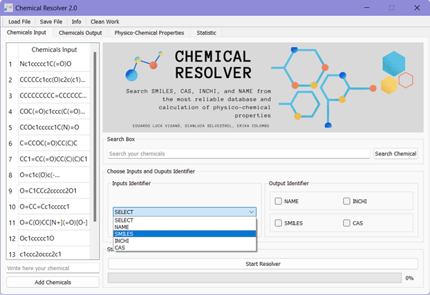
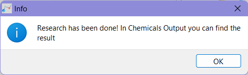
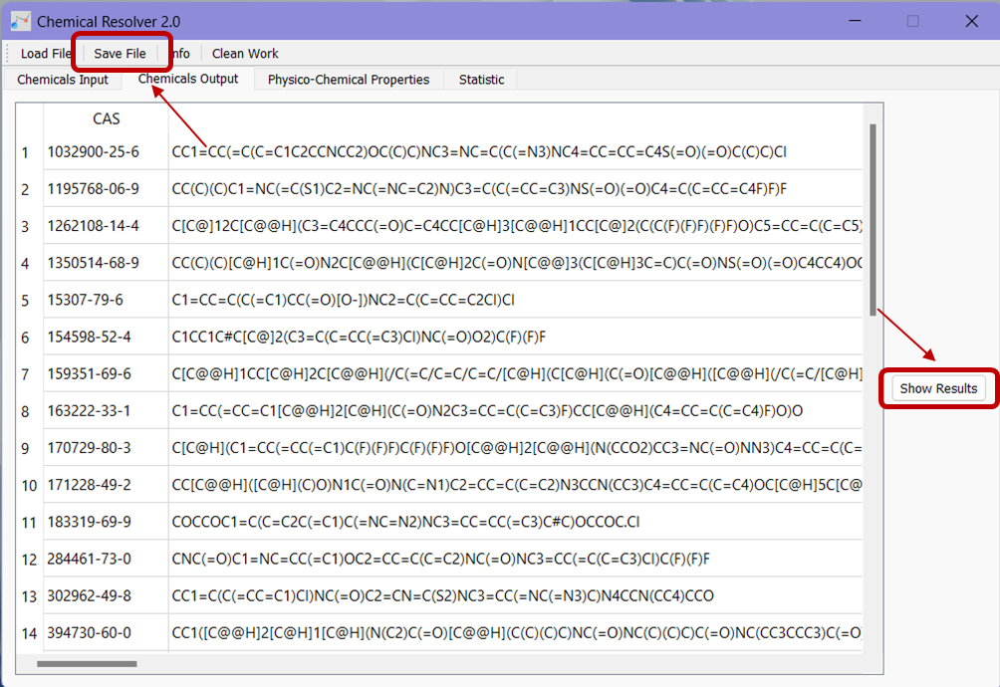
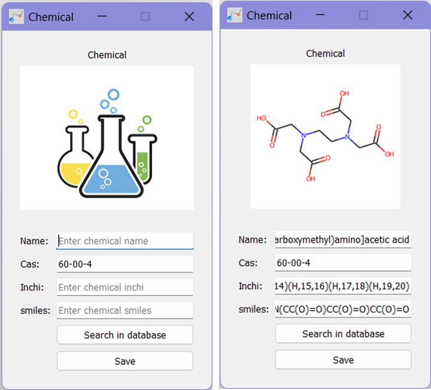

# Chemical-Resolver
Search SMILES, CAS, INCHI, and NAME from the most reliable database and calculation of physico-chemical properties

## What is it for?
The Chemical Resolver tool is useful to search in several database (PubChem, ChemID, CST, NCI, soon also ChEMBL and CompTox) SMILES, INCHI, CAS and NAME of molecules and can calculate some simple physical chemical properties such as Molecular Weight and LogP. 
The utility of this tool is to search for molecule identifiers quickly on several database in batch mode for a list of chemicals or search single molecule. 
You can visualize the chemical structure and save the image in png format. 
The advantage of searching on multiple databases is to easily check the consistency of the results obtained. 
For data curation procedure and standardization of chemical structures, we suggest using [this workflow in KNIME](https://github.com/DGadaleta88/data_curation_workflow). The Chemical Resolver can be useful also to search molecules flagged as warning in this workflow.
From the SMILES, the tool can calculated some physical-chemical properties (this list is constantly updated) useful for research purposes.

## How to use the tool
1.	Download from [here](https://marionegri-my.sharepoint.com/:f:/g/personal/edoardo_vigano_marionegri_it/EqIQx_zL3gFMkFSc18cjKOIBy0SPYDs2z1yqRkgTELtkmg) all folders and unzip all files.
2.	Open the Dist/ChemicalResolverEXE.exe
3.	Click on “Load File” and load the list of chemicals in .xlsx format. This file must have the header. The tool considered only the first column.
4.	Select the type of input in “Input Identifier”

  

5.	Select the output in “Output Identifier”
6.	Then, click on “Start Resolver” to start the research. You have to wait the following windows before show the results!

  

7.	Go to “Chemical Output” and click on “Show Results”. You can save in .xlsx file all results by clicking on “Save File”.
	

  

8.	In “Physico-Chemical properties” you can calculate some descriptors useful from the SMILES, such as the Molecular Weight (MW). You can select one descriptor or “All” descriptors. Clicking on “Start calculation” button to start the calculation, then on “Save descriptor” to save the .xlsx file. If you want the previous research and the descriptors in one file, you can click on “Save file” to obtain one single file with all information you want.
9.	Before starting the new research, click on “Clean Work”

### Other functionalities
You can search for one single molecule and save the result by clicking on the identifier. In this way, a new window is open, and you can start the single search by clicking on “Search in database” (on NCI); you can also see the molecule structure after having searched for the SMILES. You can save the result clicking on “Save”.

  

# Contacts

Edoardo Luca Viganò - Laboratory of Environmental Chemistry and Toxicology - Department of Environmental Health Sciences - Istituto di Ricerche Farmacologiche Mario Negri IRCCS - Via Mario Negri 2, 20156 Milano, Italy - e-mail: edoardo.vigano@marionegri.it

Erika Colombo - Laboratory of Environmental Chemistry and Toxicology - Department of Environmental Health Sciences - Istituto di Ricerche Farmacologiche Mario Negri IRCCS - Via Mario Negri 2, 20156 Milano, Italy -e-mail: erika.colombo@marionegri.it

Gianluca Selvestrel - Laboratory of Environmental Chemistry and Toxicology - Department of Environmental Health Sciences - Istituto di Ricerche Farmacologiche Mario Negri IRCCS - Via Mario Negri 2, 20156 Milano, Italy - e-mail: gianluca.selvestrel@marionegri.it
