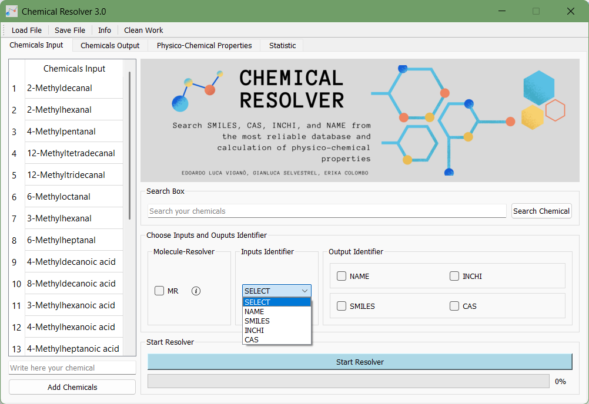
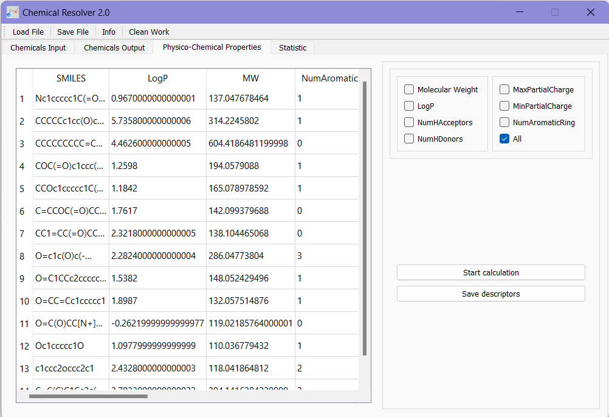

# Chemical-Resolver
Search SMILES, CAS, INCHI, and NAME from the most reliable database and calculation of physico-chemical properties

Web3Site: https://ipfs.io/ipfs/QmXFd3fS1jyE6FzRc3Z9QnRY1AXtxuUFgKSUtGMXStUEmB/

## What is it for?
The Chemical Resolver tool is useful to search in several databases (PubChem, ChemID, CST, NCI, soon also ChEMBL, CompTox and Cas Common Chemistry) SMILES, INCHI, CAS, and NAME of molecules and can calculate some simple physical-chemical properties such as Molecular Weight and LogP.

The utility of this tool is to search for molecule identifiers quickly on several databases in batch mode for a list of chemicals or search single molecule. 
You can visualize the chemical structure and save the image in png format.
The advantage of searching on multiple databases is to easily check the consistency of the results obtained. 

For data curation procedure and standardization of chemical structures, we suggest using [this workflow in KNIME](https://github.com/DGadaleta88/data_curation_workflow). The Chemical Resolver can be useful also to search molecules flagged as a warning in that workflow.

From the SMILES, the tool can calculate some physical-chemical properties (this list is constantly updated) useful for research purposes.

## How to use the tool
1.	Download from [here](https://marionegri-my.sharepoint.com/:f:/g/personal/edoardo_vigano_marionegri_it/EqIQx_zL3gFMkFSc18cjKOIBy0SPYDs2z1yqRkgTELtkmg) all folders and unzip all files.
2.	Open the Dist/ChemicalResolverEXE.exe
3.	Click on __“Load File”__ and load the list of chemicals in .xlsx format. This file must have a header. The tool considers only the first column.
4.	Select the type of input in _“Inputs Identifier”_

  

5.	Select the output in _“Output Identifier”_
6.	Then, click on __“Start Resolver”__ to start the research. You must wait for the following window to come out before you can see the results!

  

7.	Go to __“Chemical Output”__ and click on __“Show Results”__. You can save in a .xlsx file all results by clicking on __“Save File”__.
	

  

8.	In __“Physico-Chemical properties”__ you can calculate some descriptors useful from the SMILES, such as the Molecular Weight (MW). You can select one descriptor or _“All”_ descriptors. Click on the __“Start calculation”__ button to start the calculation, then on __“Save descriptor”__ to save the .xlsx file.

  

9. On __"Statistic"__ you can see the percentage of compounds (of all identifiers) that each database was able to find and the percentage of molecules for which it was possible to calculate each descriptor.

10.	Before starting the new research, click on __“Clean Work”__

### Other functionalities
By double clicking on the identifier, you can search for one single molecule and save the result. In this way, a new window is open, and you can start the single search by clicking on _“Search in database”_ (on NCI); you can also see the molecule structure after having searched for the SMILES. You can save the result by clicking on _“Save”_.

  

In the _"Add Chemical"_ section, you can upload an additional chemical before the research, using the same identifier chosen.

On _"Search Box"_ you can search for a chemical identifier in the loaded list

# Contacts

Edoardo Luca Viganò - Laboratory of Environmental Chemistry and Toxicology - Department of Environmental Health Sciences - Istituto di Ricerche Farmacologiche Mario Negri IRCCS - Via Mario Negri 2, 20156 Milano, Italy - e-mail: edoardo.vigano@marionegri.it

Erika Colombo - Laboratory of Environmental Chemistry and Toxicology - Department of Environmental Health Sciences - Istituto di Ricerche Farmacologiche Mario Negri IRCCS - Via Mario Negri 2, 20156 Milano, Italy -e-mail: erika.colombo@marionegri.it

Gianluca Selvestrel - Laboratory of Environmental Chemistry and Toxicology - Department of Environmental Health Sciences - Istituto di Ricerche Farmacologiche Mario Negri IRCCS - Via Mario Negri 2, 20156 Milano, Italy - e-mail: gianluca.selvestrel@marionegri.it
